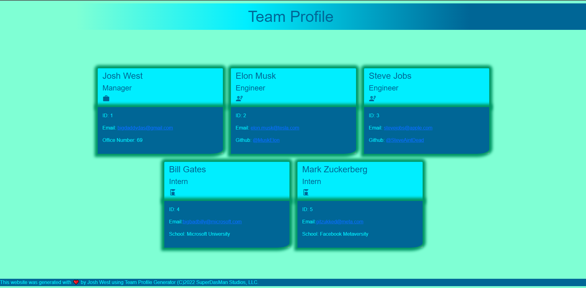

# Team Profile Generator

## 

## Description

This application will dynamically generate a webpage that displays a team's basic info to give quick access to their emails and GitHub profiles.

Built with:

JavaScript/n - HTML/n - CSS/n - ES6/n - jQuery/n - Bootstrap/n - Node

[GitHub Repo](https://github.com/SuperDasMan/Team-Profile-Generator/)

### User Story

    AS A manager
    I WANT to generate a webpage that displays my team's basic info
    SO THAT I have quick access to their emails and GitHub profiles

### Acceptance Criteria

    GIVEN a command-line application that accepts user input
    WHEN I am prompted for my team members and their information
    THEN an HTML file is generated that displays a nicely formatted team roster based on user input

    WHEN I click on an email address in the HTML
    THEN my default email program opens and populates the TO field of the email with the address

    WHEN I click on the GitHub username
    THEN that GitHub profile opens in a new tab

    WHEN I start the application
    THEN I am prompted to enter the team manager’s name, employee ID, email address, and office number

    WHEN I enter the team manager’s name, employee ID, email address, and office number
    THEN I am presented with a menu with the option to add an engineer or an intern or to finish building my team

    WHEN I select the engineer option
    THEN I am prompted to enter the engineer’s name, ID, email, and GitHub username, and I am taken back to the menu

    WHEN I select the intern option
    THEN I am prompted to enter the intern’s name, ID, email, and school, and I am taken back to the menu

    WHEN I decide to finish building my team
    THEN I exit the application, and the HTML is generated

## Table of Contents

  - [Description](#description)
  - [Installation](#installation)
  - [Usage](#usage)
  - [License](#license)
  - [Contributing](#contributing)
  - [Tests](#tests)
  - [Questions](#questions)

## Installation

Clone repository and download NodeJS. Open terminal and navigate directory to the app's root folder. Then run `node i npm` to install npm. Run `node index` and answer prompts.

## Usage

App is used to build a profile of a team with information on each member within their own designated profile card.

## Screenshot

## License

### [License](#license)

This application is covered by the [MITlicense]([![MIT]](https://opensource.org/licenses/MIT)).

Check out the badges hosted by [shields.io](https://shields.io/).

## Contributing

No contributing developers at this time.

## Tests

Jest - TDD on each function within the separate modules to reduce likelihood of errors

## Questions

For any questions, comments, or bug reports, please reach out to me at [GitHub: SuperDasMan](https://github.com/SuperDasMan) or [Email me](mailto:joshwest.biz@gmail.com)

_This README was generated with ❤️ by Josh West using [README-generator](https://github.com/SuperDasMan/README-Generator)_

(C)2022 SuperDasMan Studios, LLC.
